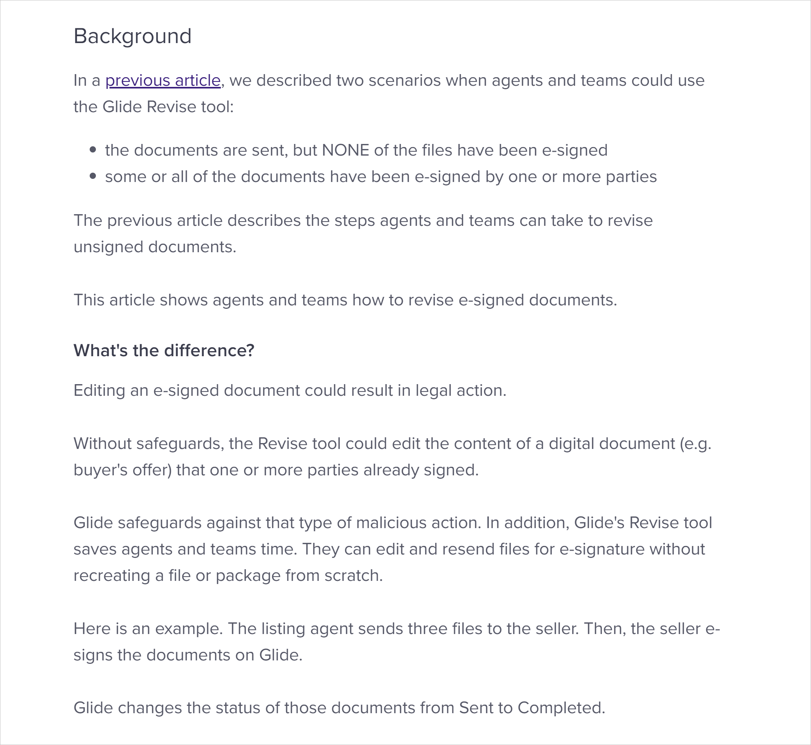
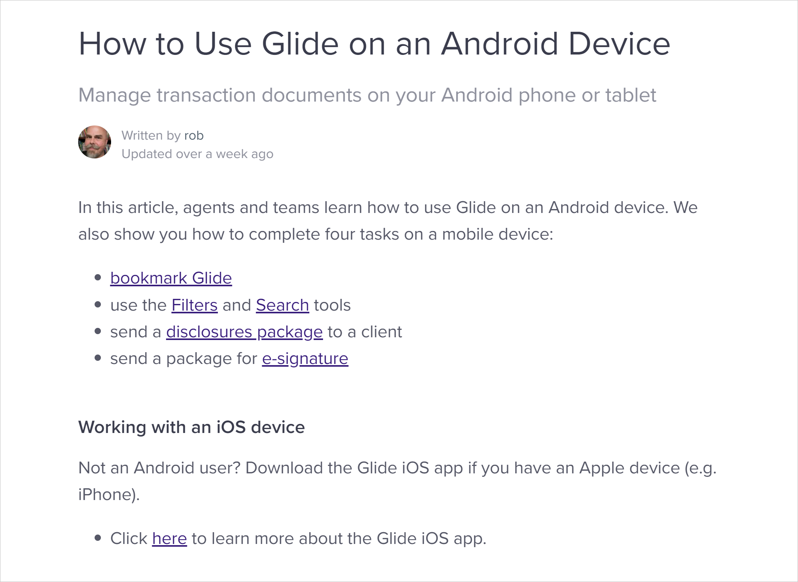
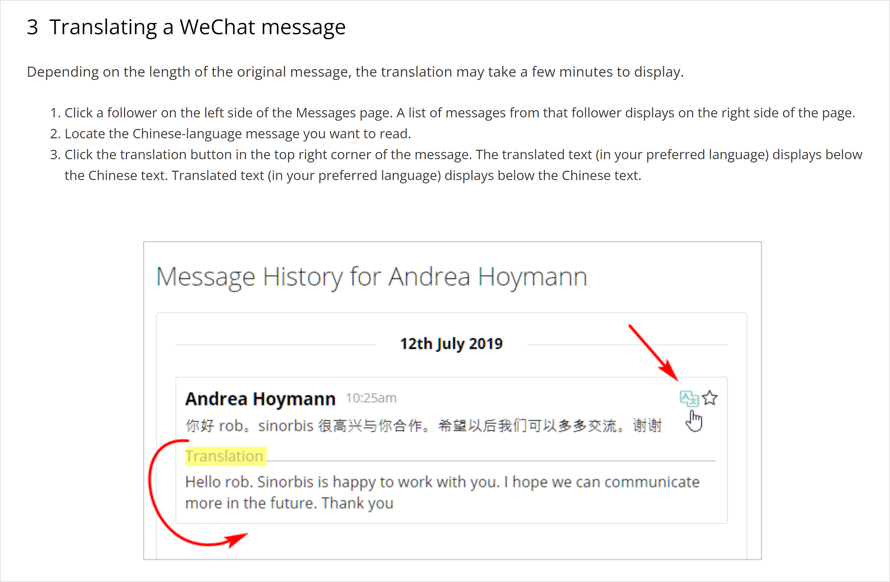
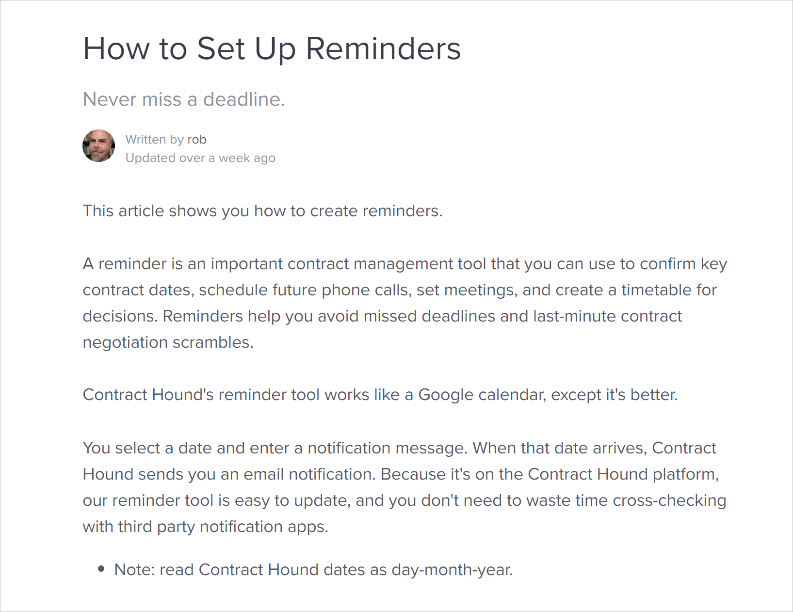
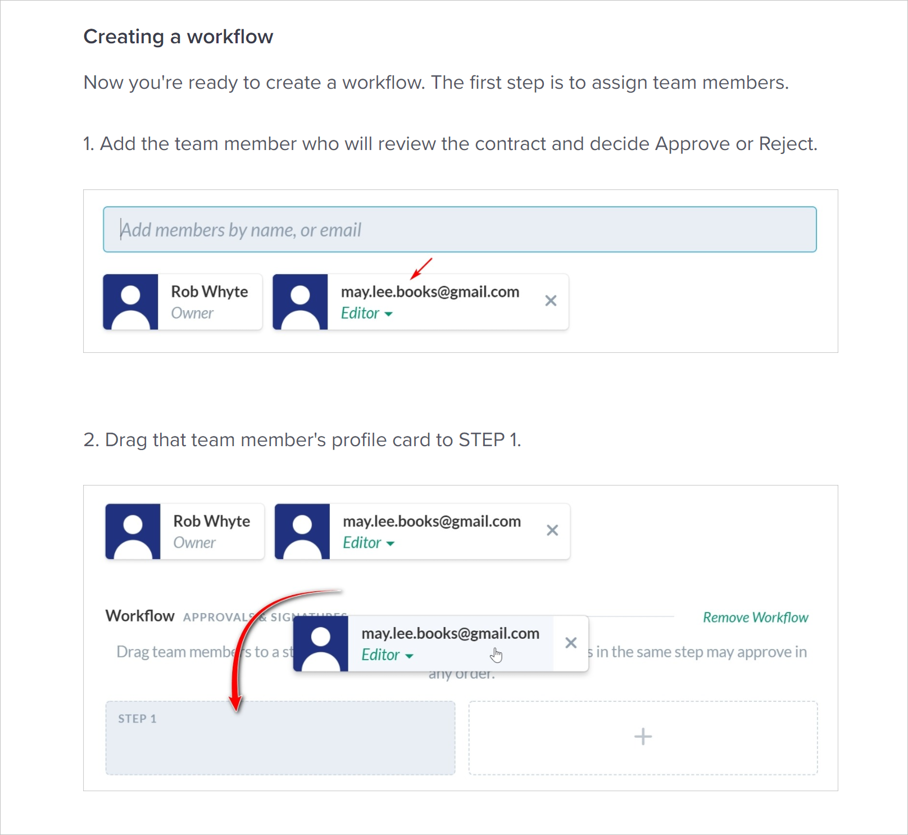
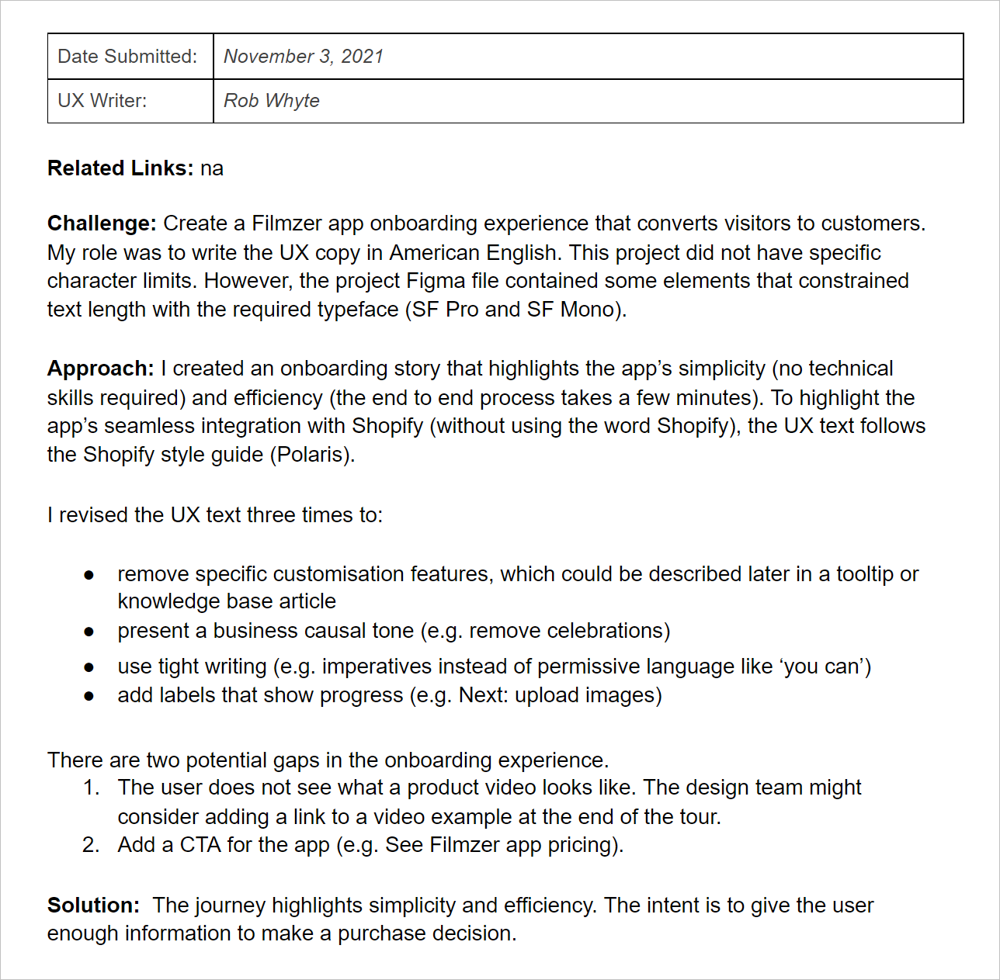
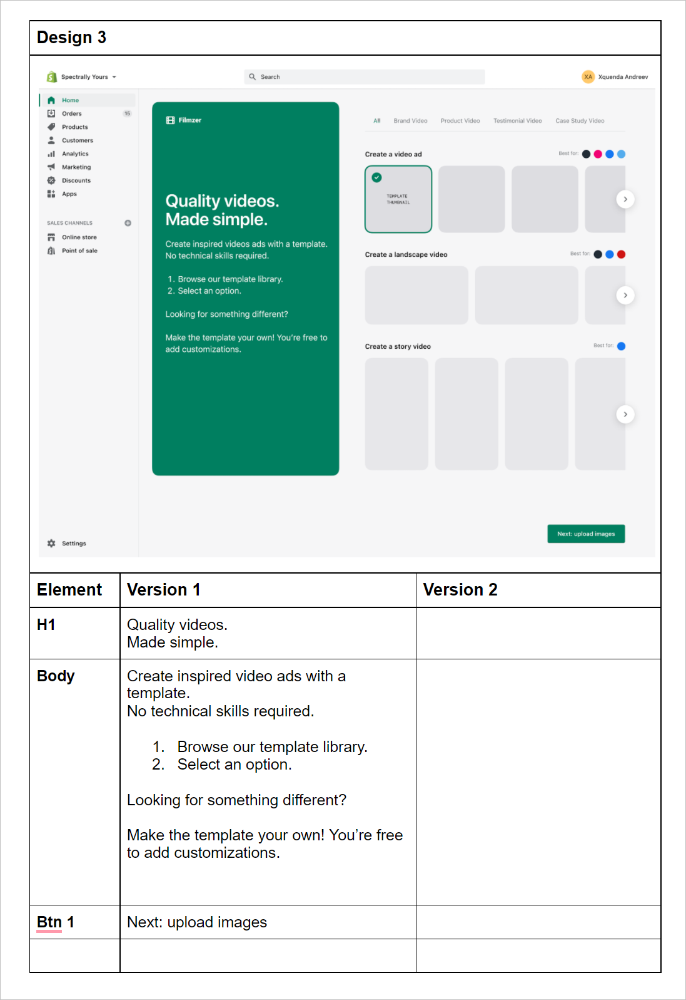
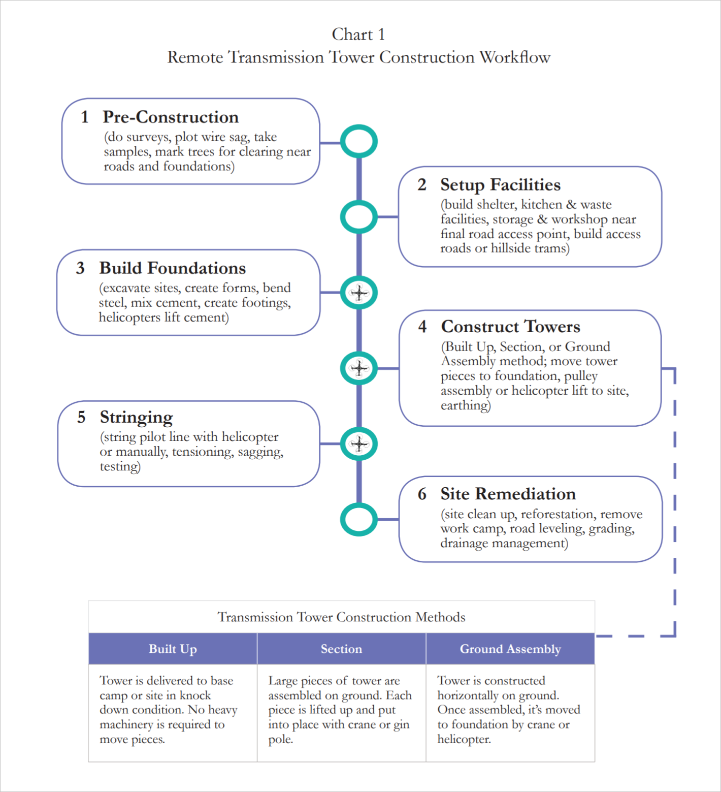
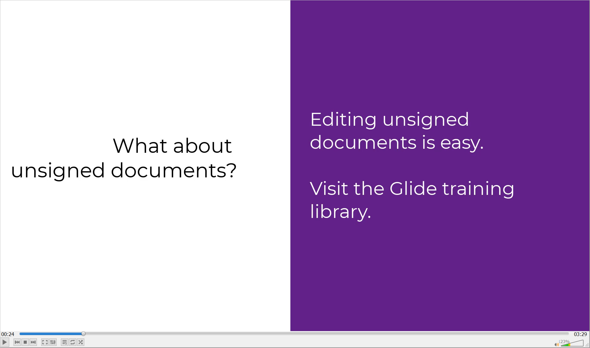
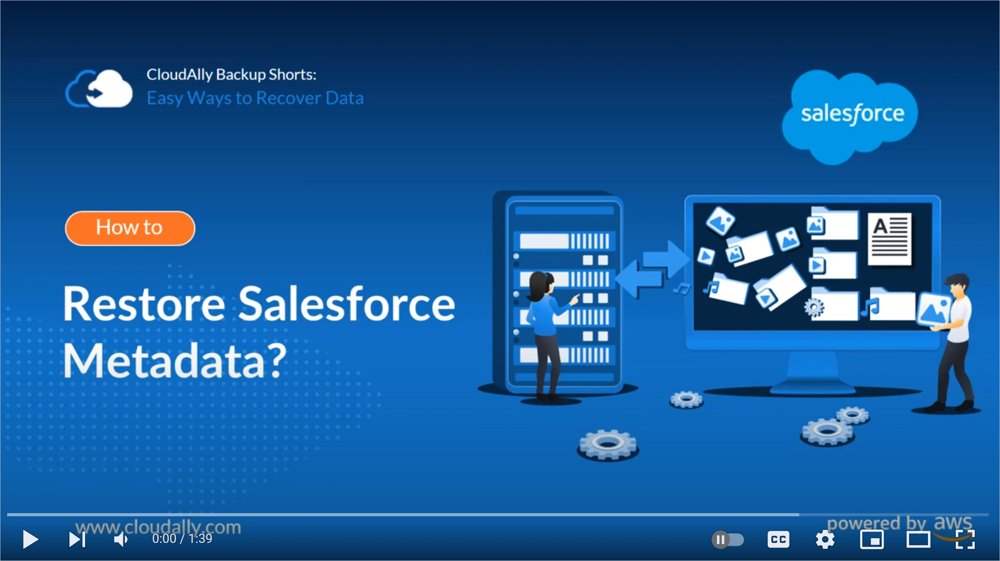

## About
  Rob has been writing professionally for 25+ years. Fresh out of graduate school (M.Sc. Urban Planning), he wrote technical reports and proposals for an environmental consultancy in Toronto. Eager to explore the world, he moved to Asia, where the Wheel of Fortuna showed her hand.

A freelance technical writer since 2018, he specializes in user documentation for SaaS platforms. Before that, he honed his professional writing chops as a Lonely Planet author and learned the art of simplifying instructions as a teacher. 

Rob comes to technical writing with an ear for plain English communication, a head for breaking down complex operations, and an eye for documentation that reduces user friction.  
   

> [CONTACT](mailto:robbusan@yahoo.com)&nbsp;&nbsp;&nbsp;&nbsp;&nbsp;<a href="https://www.linkedin.com/in/robwhyte/">LINKEDIN</a>{:target="_blank"}

## Glide help center
This San Francisco SaaS startup changed the way real estate agents work by creating a digital platfom for transaction documents and an e-signature tool.
##### The problem
The company needed an expert writer to quickly learn the platform, write help center content, and create explainer videos.
##### My role
Took charge of the knowledge base and wrote 50+ articles. Scripted, recorded, and [explainer videos](https://help.glide.com/en/articles/5026910-how-to-create-an-offer-package){:target="_blank" rel="noopener"}.
##### Results
Created an easy to search mature Intercom help center. Currently provide maintenance services to support new releases.
##### Tools
* Camtasia
* Intercom
* Fastone Capture
   

   
  
   
    
## Sinorbis knowledge base
Based in Sydney, Australia, this SaaS CMS provides a drag and drop web builder for entrepreneurs hoping to create an online presence in China. In addition to the intuitive UI, Sinorbis' hosting service delivers web access on the other side of China's Great Firewall.
 
##### The problem
The company needed a knowledge base to support its rapidly growing client base and revamp its technical support system.
 
##### My role
I built the company's knowledge base from scratch. The work started with a rough information architecture mapped out on a few PPT slides. Eighteen months later, the help site had reached maturity.
 
##### Results
Delivered an easy to search Zendesk help center. The knowledge base articles help the Support Team. Instead of manually respoding to every ticket, the system send out links to how-to articles.
 
##### Tools
* Zendesk
* Fastone Capture
* MS Excel
* PPT
   

 
  
   
## Contract Hound knowledge base
Based in Singapore, this vertical SaaS startup helps clients store, locate, and manage contracts.
##### The problem
Before launching its upated product, the CEO asked me to write the content for a quick start.
##### My role
Created the guide from scratch. Learned the platform, outlined the required content, wrote the how-to articles.
##### Results
Delivered 10 articles and completed the help center.
##### Tools
* Intercom
* Fastone Capture
 

 
  

   
    
## UX Writing
Independent onboarding project.
##### The problem
Write onboarding copy for an app that increases conversion rates.
##### My role
Write the UX text and create a copy doc.
##### Results
Created doc copy.
##### Tools
* Figma
* Google docs
 
 

   
  
   
    
## B2B White paper
Based in Tokyo, this client sells heavy lift drones and operates a drone pilot school.
##### The problem
The client needed a white paper to document the technical and financial feasibility of heavy lift drones for remote construction projects.
##### My role
Conducted technical and financial research. Developed cost scenarios. Completed all layout and document design work. A key challenge was to simplify complex language for the intended reader (technically proficient engineers who were non-native English speakers).
##### Results
Successfully delivered a 17-page PDF before the project deadline. 
##### Tools
* InDesign
* Photoshop
 
 

   

   
    
## B2B explainer videos
Various clients.
##### The problem
The client needs a tutorial video to demonstrate or explain a specific task or feature.
##### My role
Script, record, narrate, and edit screen recordings. The key to a successful outcome is getting feedback from all parties before recording. 
##### Results
Deliver mp4 files on time. 
##### Tools
* Camtasia
* Google Docs
   
    
[!](https://drive.google.com/file/d/1HU0M-hpU7hoCl-VA36S4DDJKT2X6PKFk/view?usp=sharing)
   
[!](https://www.youtube.com/watch?v=h8TJHeE9wXM)

