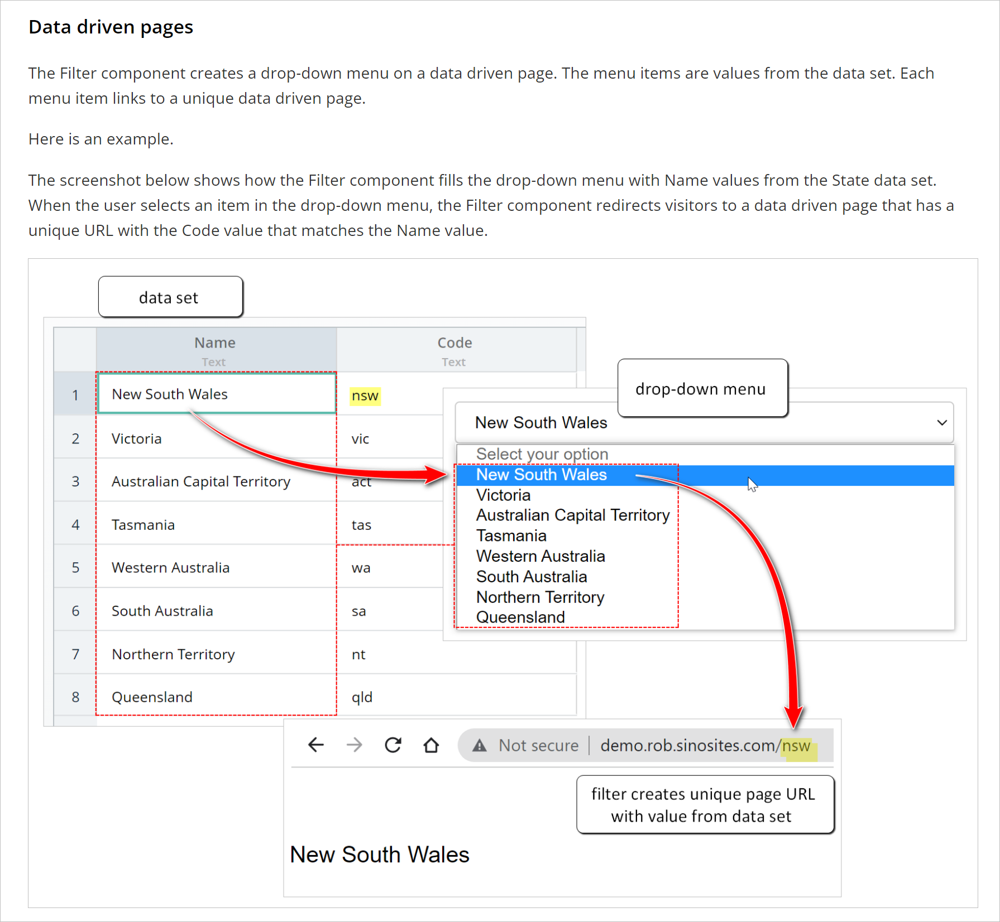

# Project Samples
Technical writer and published author with a background in instructional design and training. This portfolio contains samples from SaaS user documentation projects.

  
<br>  
# Sinorbis    
Based in Sydney, Australia, this SaaS CMS provides a drag and drop web builder for entrepreneurs hoping to create an online presence in China. In addition to the intuitive UI, Sinorbis' hosting service delivers web access on the other side of China's Great Firewall.

#### The problem  
The company needed a knowledge base to support its rapidly growing client base and revamp its technical support system. 
<br>  
  <br>

<br>  
#### My role  
I built the company's knowledge base from scratch. The work started with a rough information architecture mapped out on a few PPT slides. Eighteen months later, the help site had reached maturity.
<br>  
### Results
Delivered an easy to search Zendesk help center. The knowledge base articles help the Support Team. Instead of manually respoding to every ticket, the system send out links to how-to articles.  
<br>  
#### Tools  
* Zendesk
* Fastone Capture
* MS Excel
* PPT  


<hr />


Markdown is a lightweight and easy-to-use syntax for styling your writing. It includes conventions for

```markdown
Syntax highlighted code block

# Header 1
## Header 2
### Header 3

- Bulleted
- List

1. Numbered
2. List

**Bold** and _Italic_ and `Code` text

[Link](url) and 
```

For more details see [GitHub Flavored Markdown](https://guides.github.com/features/mastering-markdown/).

### Jekyll Themes

Your Pages site will use the layout and styles from the Jekyll theme you have selected in your [repository settings](https://github.com/writingteacher/rob-whyte-portfolio/settings/pages). The name of this theme is saved in the Jekyll `_config.yml` configuration file.

### Support or Contact

Having trouble with Pages? Check out our [documentation](https://docs.github.com/categories/github-pages-basics/) or [contact support](https://support.github.com/contact) and we’ll help you sort it out.
