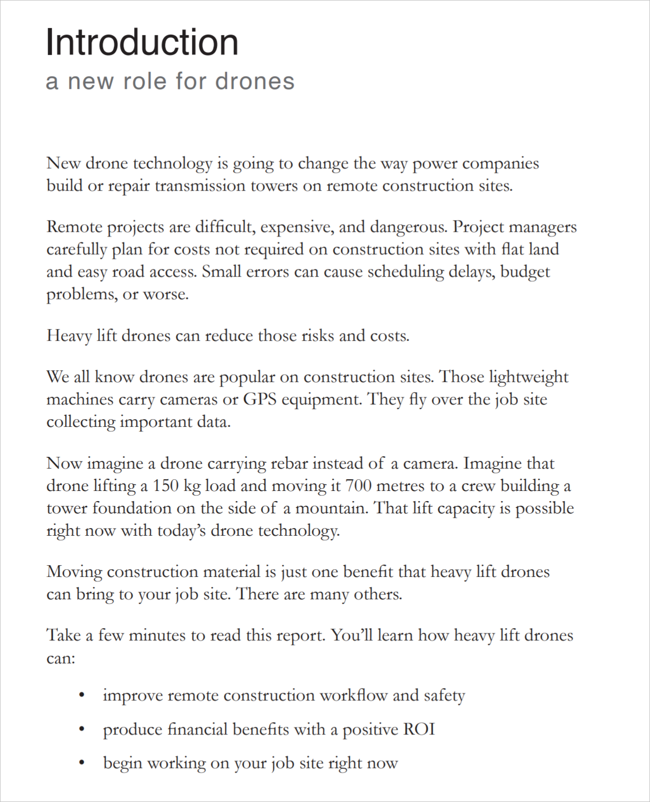
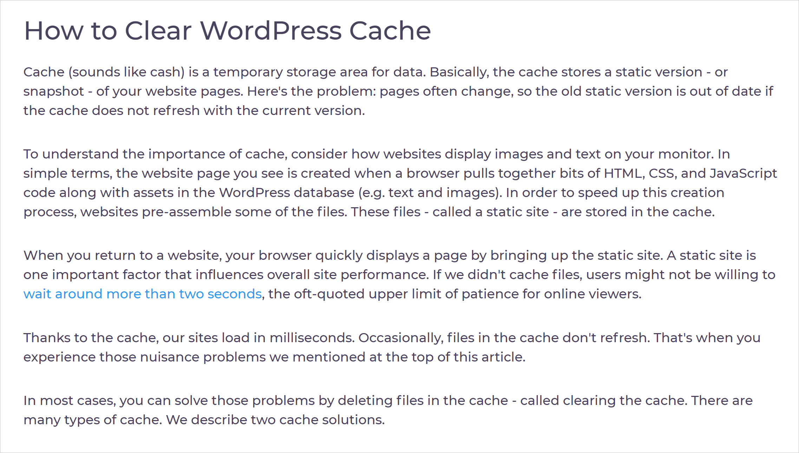
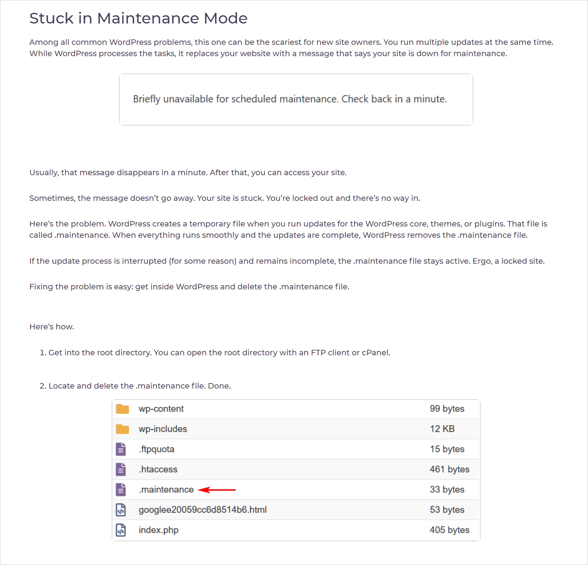
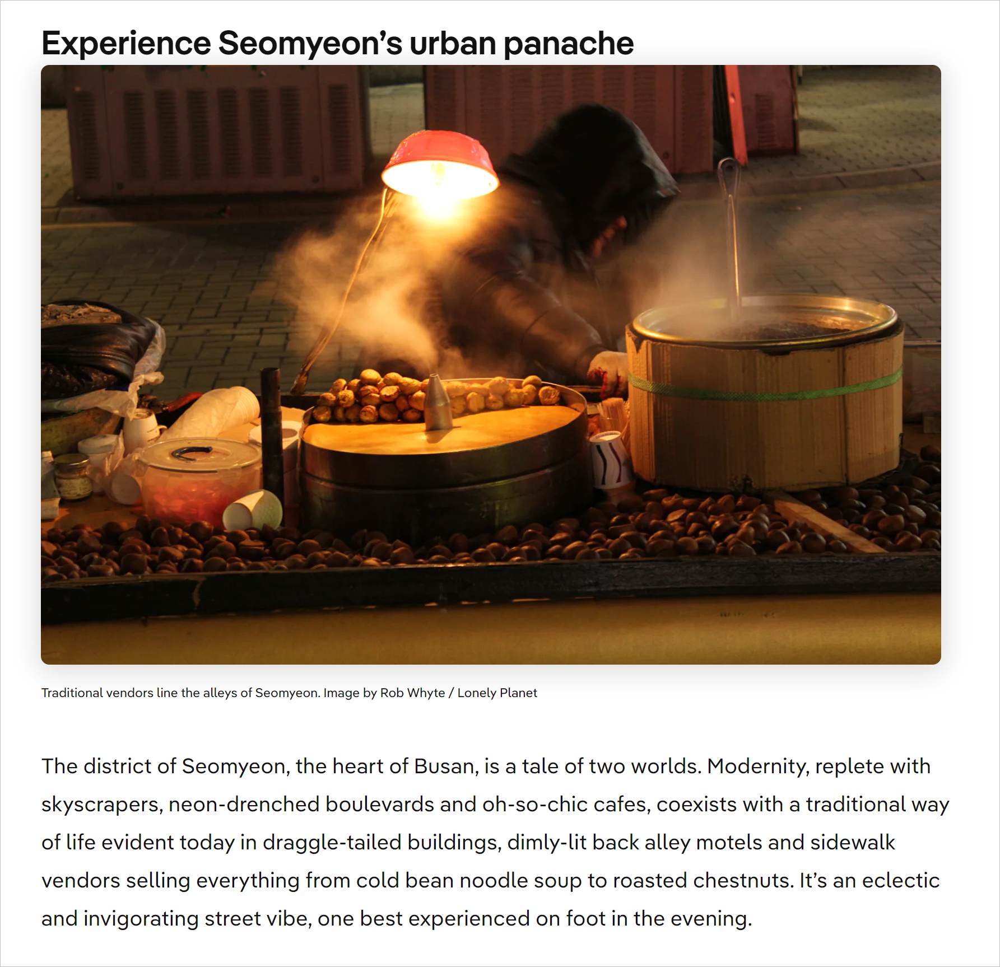
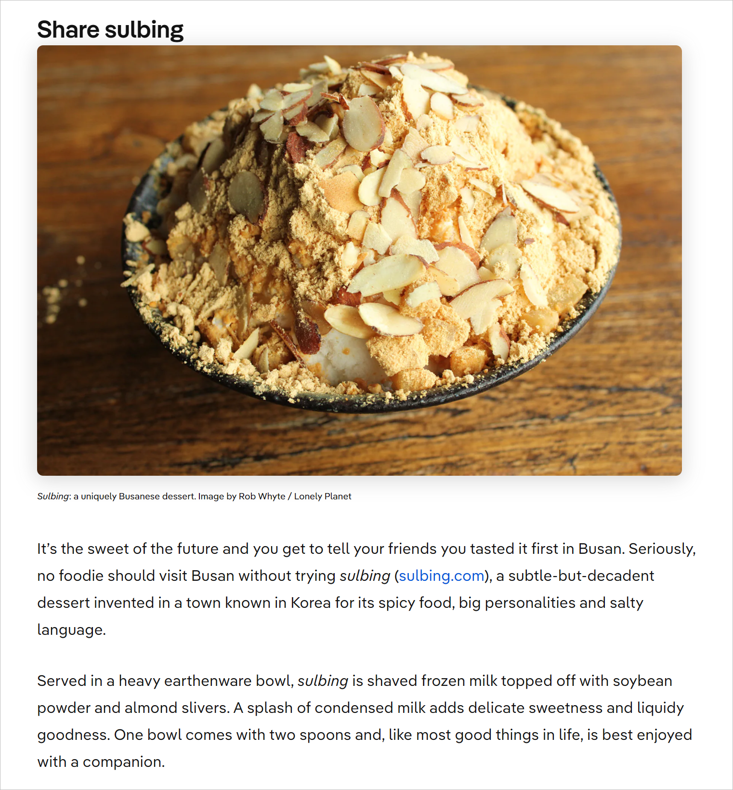

## About
 A freelance technical writer since 2018, Rob specializes in user documentation for vertical SaaS platforms and enterprise software. On occasion, he creates and narrates explainer videos.

Before technical writing, he honed his professional research and writing skills as a Lonely Planet author, generated organic traffic as a B2B SEO content writer, and learned the art of simplifying instructions as a teacher. 

An avid learner, Rob has completed courses in technical writing fundamentals, UX writing, and e-learning instructional design. He is currently working on a capstone project to complete an eMBA.
 

> [CONTACT](mailto:robbusan@yahoo.com)&nbsp;&nbsp;&nbsp;&nbsp;&nbsp;<a href="https://www.linkedin.com/in/robwhyte/">LINKEDIN</a>{:target="_blank"}

<!-- -->
## Glide help center
This San Francisco SaaS startup changed the way real estate agents work by creating a digital platform for transaction documents and an e-signature tool.
##### The problem
The company needed an expert writer to quickly learn the platform, write help center content, and create explainer videos.
##### My role
Took charge of the knowledge base and wrote 50+ articles. Scripted, recorded, and [explainer videos](https://help.glide.com/en/articles/5026910-how-to-create-an-offer-package){:target="_blank" rel="noopener"}.
##### Results
Created an easy to search mature Intercom help center. Currently provide maintenance services to support new releases.
##### Tools
* Camtasia
* Intercom
* Fastone Capture
 

 

 
 
## Sinorbis knowledge base
Based in Sydney, Australia, this SaaS CMS provides a drag and drop web builder for entrepreneurs hoping to create an online presence in China.
 
##### The problem
The company needed a knowledge base to support its rapidly growing client base and revamp its support system.
 
##### My role
I built the company's knowledge base from scratch. The work started with a rough information architecture mapped out on a few PPT slides. Eighteen months later, the help site had reached maturity.
 
##### Results
Delivered an easy to search Zendesk help center which reduces Support Team workload. Instead of manually respoding to every ticket, the omnichannel support system sends out links to relevant how-to articles.
 
##### Tools
* Zendesk
* Fastone Capture
* MS Excel
* PPT
 

 

## Contract Hound quick start guide
Based in Singapore, this vertical SaaS startup helps clients store, locate, and manage contracts.
##### The problem
Before launching its updated service, the CEO asked me to write the content for a quick start guide.
##### My role
Created the guide from scratch. Learned the platform, outlined the required content, wrote the how-to articles.
##### Results
Delivered 10 articles and completed the help center.
##### Tools
* Intercom
* Fastone Capture
 

   

 
 
## UX Writing
Independent onboarding project.
##### The problem
Write onboarding copy for an app that increases conversion rates.
##### My role
Write the UX text and create a copy doc.
##### Results
Created copy doc.
##### Tools
* Figma
* Google docs
 

 

 
 
## B2B white paper
This Tokyo-based client sells drones and runs a drone pilot school.
##### The problem
The client needed a white paper to document the technical and financial feasibility of heavy lift drones for remote pylon construction projects.
##### My role
I developed a use case scenario and then researched the technical and financial implications. A key challenge was simplifying complex language for the intended reader (technically proficient engineers who were non-native English speakers). In addition to writing the paper, I designed the final PDF. 
##### Results
Successfully delivered a 17-page PDF before the project deadline. 
##### Tools
* InDesign
* Photoshop
 

 

 
 
## B2B explainer videos
Various clients.
##### The problem
The client needs a tutorial video to demonstrate or explain a specific task or feature.
##### My role
Script, record, narrate, and edit screen recordings. The key to a successful outcome is getting feedback from all parties before recording. 
##### Results
Deliver mp4 files on time. 
##### Tools
* Camtasia
* Google Docs
 
{:target="_blank" rel="noopener"}
 
{:target="_blank" rel="noopener"}
 
 
## Online SEO writing 
WPBlazer is a WordPress plugin developer. After writing all of the knowledge base articles, the client asked me to write SEO content. 
##### The problem
The client wanted to increase organic site traffic.
##### My role
Wrote monthly posts (700 to 1200 words) that met client specs. All articles had to meet Yoast SEO criteria and pass plagiarism and reading level tests.
##### Results
Successfully delivered 10 blog posts. 
##### Tools
* WordPress
* Hemingway editor
* Faststone Capture
 

 

 
 
## Lonely Planet country guide 
LP is a global brand known for guidebooks and publications that inspire exploration. 
##### The problem
Roll out a new South Korea country guide and support organic traffic.
##### My role
In addition to researching and co-authoring the country guidebook, I wrote online pieces for two Korean destinations.
##### Results
Successfully all content. 
##### Tools
* Google Docs
* enterprise pubishing software
 

 

 
 
